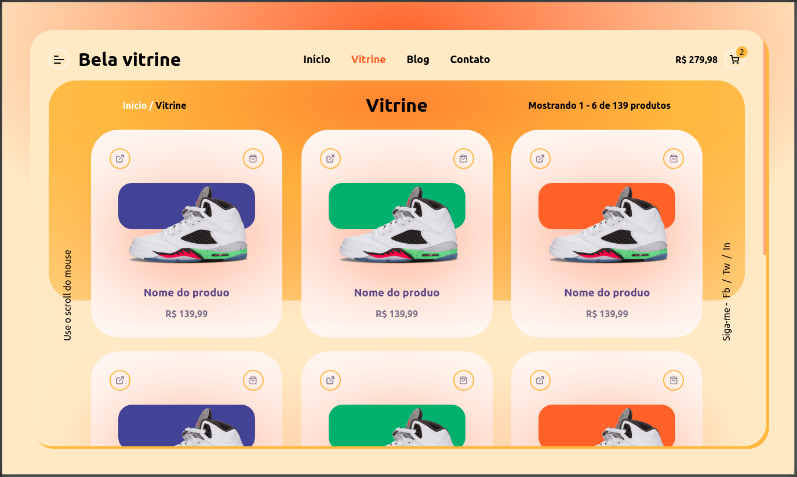

# Bela vitrine

Desenvolvido em live na [Twitch](https://www.twitch.tv/videos/763608167).

O Site foi desenvolvido apenas com o intuito de treinar e repassar o conhecimento sobre CSS.

Quer visualizar em seu computador ou clonar o repositório, use o commando:

`git clone https://github.com/jeanmolossi/bela-vitrine.git`

Preview

### :art: Não está responsivo.

Se quiser aceitar o desafio, deixe responsivo e faça um pull request, ficarei feliz em recebê-lo
